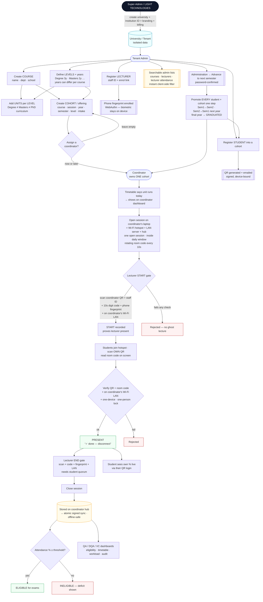
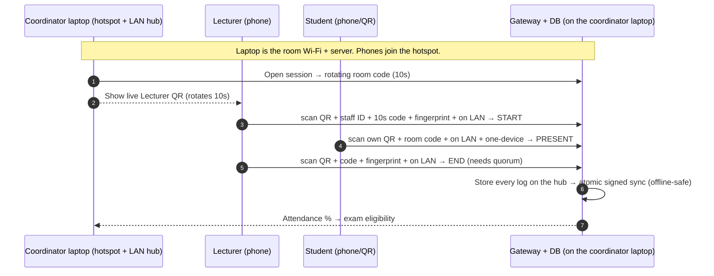

# QAAT — Whole-System Flowchart

> One diagram, end to end. Renders on GitHub & VS Code (Markdown Preview Mermaid).
> **Powered by LIGHT TECHNOLOGIES.**

```mermaid
flowchart TD
    %% ===== Platform =====
    SA([Super-Admin / LIGHT TECHNOLOGIES]):::owner
    SA -->|create university + Institution ID + branding + billing| T[(University / Tenant<br/>isolated data)]:::tenant

    %% ===== Admin setup =====
    T --> AD([Tenant Admin]):::role
    AD --> C[Create COURSE<br/>name · dept · school]
    AD --> LV[Define LEVELS + years<br/>Degree 3y · Masters 2y …<br/>years can differ per course]
    C --> U[Add UNITS per LEVEL<br/>Degree ≠ Masters ≠ PhD curriculum]
    LV --> U
    C --> CO[Create COHORT / offering<br/>course · session · year · semester · level · intake]
    LV --> CO
    CO --> ASN{Assign a<br/>coordinator?}
    ASN -->|now or later| COOR([Coordinator<br/>owns ONE cohort]):::role
    ASN -->|leave empty| CO

    %% ===== People =====
    AD --> REG[Register STUDENT into a cohort]
    REG --> QR[[QR generated + emailed<br/>signed, device-bound]]
    AD --> RL[Register LECTURER<br/>staff ID + enrol link]
    RL --> BIO[[Phone fingerprint enrolled<br/>WebAuthn — biometric stays on device]]
    AD --> SRCH[[Searchable admin lists<br/>courses · lecturers · lecturer attendance<br/>instant client-side filter]]:::store

    %% ===== Daily session =====
    COOR --> TT[Timetable says unit runs today<br/>→ shows on coordinator dashboard]
    TT --> OPEN[Open session on coordinator's laptop<br/>= Wi-Fi hotspot + LAN server + hub<br/>one open session · inside daily window<br/>rotating room code every 10s]
    OPEN --> LSTART{Lecturer START gate}
    LSTART -->|scan coordinator QR + staff ID<br/>+ 10s digit code + phone fingerprint<br/>+ on coordinator's Wi-Fi LAN| LOK[START recorded<br/>proves lecturer present]
    LSTART -->|fails any check| LX[Rejected — no ghost lecture]:::bad
    LOK --> SCAN[Students join hotspot · scan OWN QR<br/>read room code on screen]
    SCAN --> SV{Verify QR + room code<br/>+ on coordinator's Wi-Fi LAN<br/>+ one-device · one-person lock}
    SV -->|ok| PRES[PRESENT<br/>“✓ done — disconnect”]:::ok
    SV -->|fail| SX[Rejected]:::bad
    PRES --> LEND[Lecturer END gate<br/>scan + code + fingerprint + LAN<br/>needs student quorum]
    LEND --> CLOSE[Close session]
    CLOSE --> SYNC[(Stored on coordinator hub<br/>→ atomic signed sync · offline-safe)]:::store

    %% ===== Outputs =====
    SYNC --> ELIG{Attendance % ≥ threshold?}
    ELIG -->|yes| OKEL[ELIGIBLE for exams]:::ok
    ELIG -->|no| NOEL[INELIGIBLE — deficit shown]:::bad
    SYNC --> DASH[QA / DQA / VC dashboards<br/>eligibility · timetable · workload · audit]
    PRES --> SPORT[Student sees own % live<br/>via their QR login]

    %% ===== Semester rollover =====
    AD --> ADV[[Administration → Advance to next semester<br/>password-confirmed]]
    ADV --> PROMO[Promote EVERY student + cohort one step<br/>Sem1→Sem2 · Sem2→Sem1 next year<br/>final-year → GRADUATED]
    PROMO --> COOR
    PROMO --> REG

    classDef owner fill:#0f172a,color:#fff,stroke:#0f172a;
    classDef tenant fill:#ecfeff,stroke:#0891b2;
    classDef role fill:#eef2ff,stroke:#6366f1;
    classDef ok fill:#f0fdf4,stroke:#16a34a;
    classDef bad fill:#fef2f2,stroke:#b91c1c;
    classDef store fill:#fffbeb,stroke:#f59e0b;
```

### The attendance gate, as a sequence

```mermaid
sequenceDiagram
    autonumber
    participant C as Coordinator laptop (hotspot + LAN hub)
    participant L as Lecturer (phone)
    participant S as Student (phone/QR)
    participant G as Gateway + DB (on the coordinator laptop)
    Note over C,G: Laptop is the room Wi-Fi + server. Phones join the hotspot.
    C->>G: Open session → rotating room code (10s)
    C-->>L: Show live Lecturer QR (rotates 10s)
    L->>G: scan QR + staff ID + 10s code + fingerprint + on LAN → START
    S->>G: scan own QR + room code + on LAN + one-device → PRESENT
    L->>G: scan QR + code + fingerprint + on LAN → END (needs quorum)
    G->>G: Store every log on the hub → atomic signed sync (offline-safe)
    G-->>C: Attendance % → exam eligibility
```
